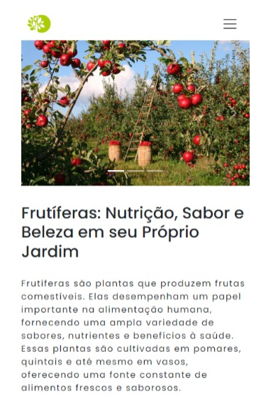
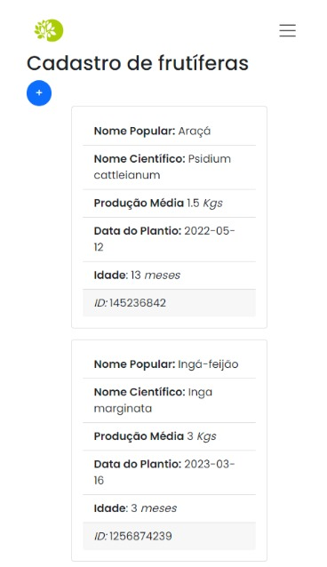
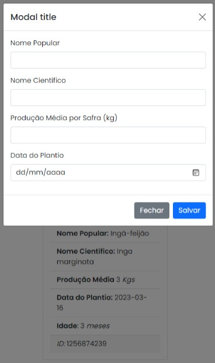
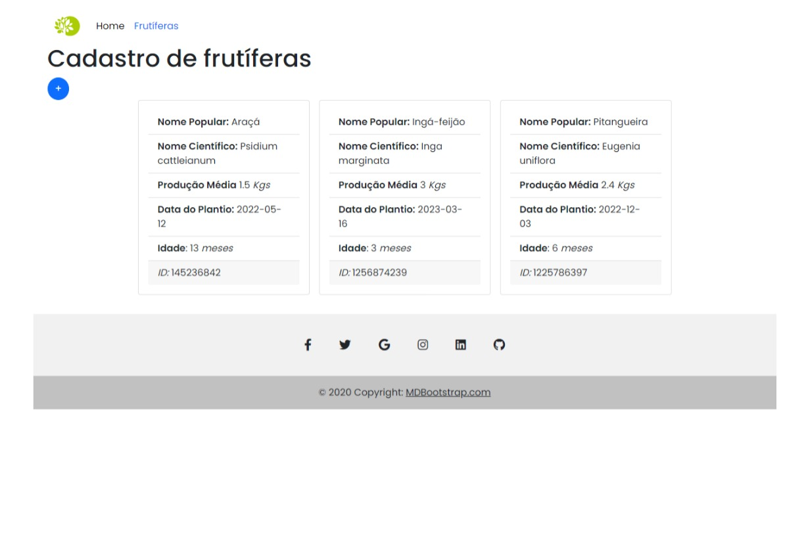
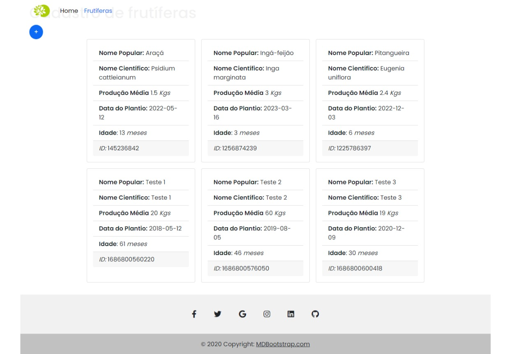

# frutifera-js

# Uma aplicação web construída utilizando HTML, CSS, JavaScript e Bootstrap. Permite aos usuáris adicionar árvores frutíferas ao seu jardim.
 
 Utiliza modais para fornecer uma experiência perfeita aos usuários, permitindo que eles insiram todas as informações necessárias sobre as plantas frutíferas que desejam 
 adicionar. Uma vez fornecidos os detalhes, cards são gerados dinamicamente e exibidos na página HTML.

 Impulsionado por JavaScript, manipulação do DOM e JSON, esta aplicação apresenta a combinação perfeita de funcionalidade baseada em formulários e design.

### Screenshot

